# Mobile Application Development

## Part A

### 1

Create an application to design aVisiting Card. The Visiting card should havea companylogoatthe top right corner. The company name should be displayed in Capital letters, aligned to the center. Information like the name of the employee, job title, phone number, address, email, fax and the website address isto be displayed. Insert a horizontal line between the job title and the phone number.

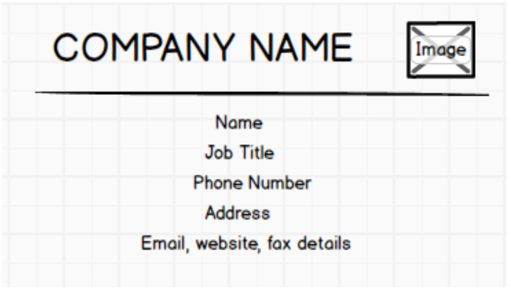


### 2

Develop an Android application usingcontrols like Button, TextView, EditText for designing a calculator having basic functionality like Addition, Subtraction, Multiplication and Division.

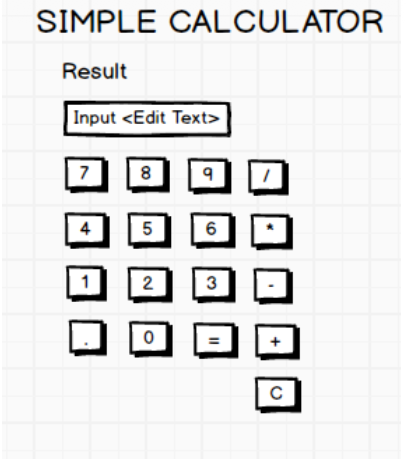

### 3

Create a SIGN Up activity with Username and Password. Validation of password should happen based on the following rules:
- Password should contain uppercase and lowercase letters.
- Password should contain letters and numbers.
- Password should contain special characters.
- Minimum length of the password (the default value is 8).

On successful SIGN UP proceed to the next Login activity. Here the user should SIGN IN using the Username and Password created during signup activity. If the Username and Password are matched then navigate to the next activity whichdisplays a message saying “Successful Login” or else display a toast message saying “Login Failed”.The user is given only two attempts and after thatdisplay a toast message saying “Failed Login Attempts” and disable the SIGN IN button. Use Bundle to transfer information from one activity to another.

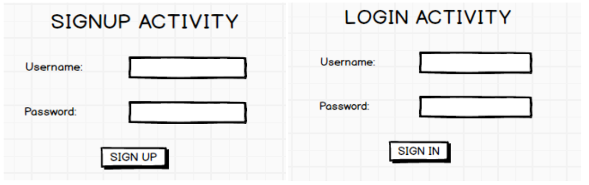

### 4

Develop an application to set an image as wallpaper. On click of a button, the wallpaper image should start to change randomly every 30 seconds.

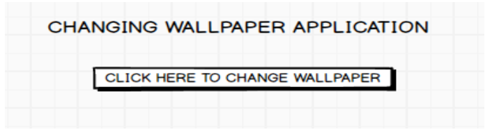

### 5

Write a program to create an activity with two buttons START and STOP. On pressing of the START button, the activity must start the counter by displaying the numbers from One and the counter must keep on counting until the STOP button is pressed. Display the counter value in a TextViewcontrol.

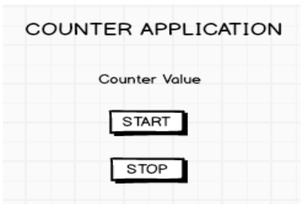

### 6

Create two files of XML and JSON type with values for City_Name, Latitude, Longitude, Temperature,andHumidity. Develop an application to create an activity with two buttons to parse the XML and JSON files which when clicked should display the data in their respective layouts side by side.

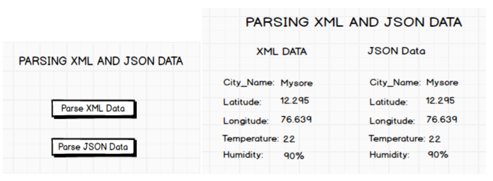

### 7

Develop a simple application withoneEditTextso that the user can write some text in it. Create a button called “Convert Text to Speech” that converts the user input text into voice

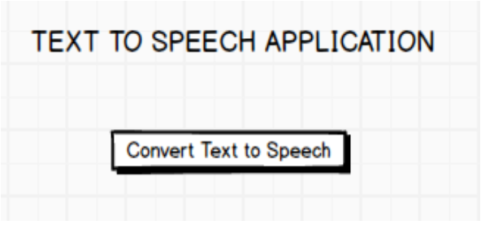

### 8

Create an activity like a phone dialer with CALL and SAVE buttons. On pressing the CALL button, it must call the phone number and on pressing the SAVE button it must save the number to the phone contacts.

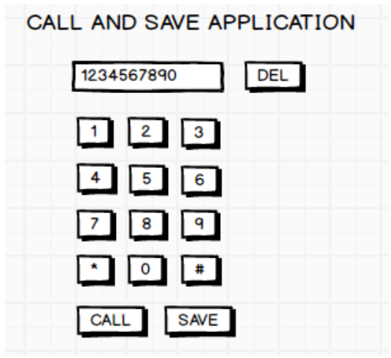


## Part B

### 1

Write a program to enter Medicine Name, Date and Time of the Day as input from the user and store it in the SQLite database. Input for Time of the Day should be either Morning or Afternoon or Eveningor Night. Trigger an alarm based on the Date and Time of the Day and display the Medicine Name.

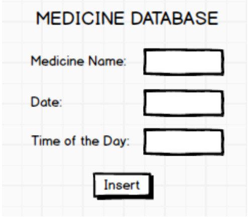

### 2

Develop a content provider application with an activity called “Meeting Schedule” which takes Date, Time and Meeting Agenda as input from the user and store this information into the SQLite database. Create another application with an activity called “Meeting Info” having DatePicker control, which on the selection of a date should display the Meeting Agenda information for that particular date, else it should display a toast message saying “No Meeting on this Date”.

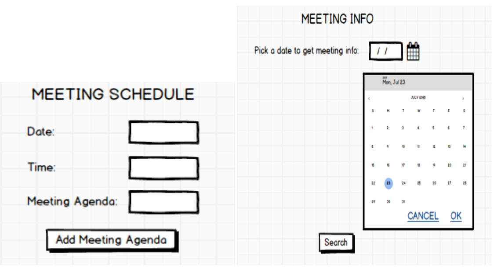

### 3

Create an application to receive an incoming SMS which is notified to the user. On clicking this SMS notification, the message content and the number should be displayed on the screen. Use appropriate emulator control to send the SMS message to your application.

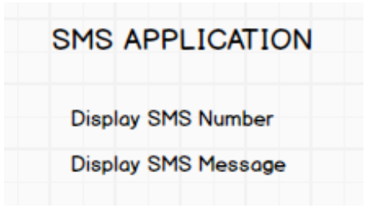

### 4

Write a program to create an activity having a Text box, and also Save, Open and Create buttons. The user has to write some text in the Text box. On pressing the Create button the text should be saved as a text file in MkSDcard. On subsequent changes to the text, the Save button should be pressed to store the latest content to the same file. On pressing the Open button, it should display the contents from the previously stored files in the Text box. If the user tries to save the contents in the Textbox to a file without creating it, then a toast message has to be displayed saying “First Create a File”.

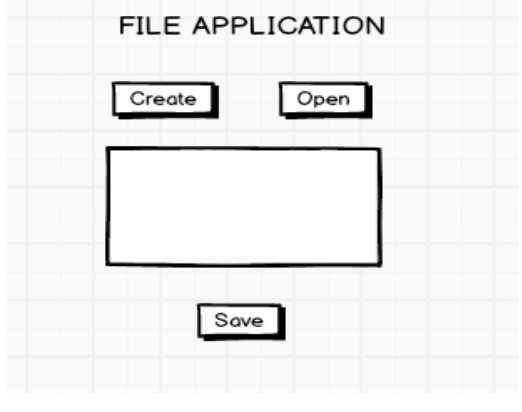

### 5

Create an application to demonstrate a basic media playerthat allows the user to Forward, Backward, Play and Pause an audio. Also, make use of the indicator in the seek bar to move the audio forward or backward as required.

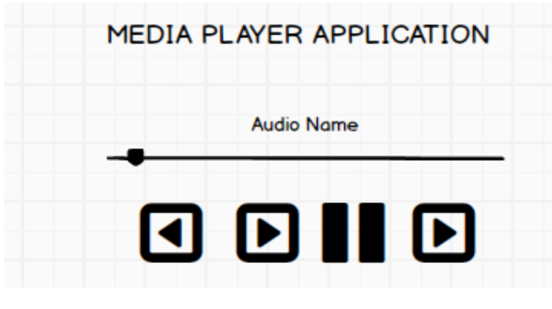

### 6

Develop an application to demonstrate the use of Asynchronous tasks in android. The asynchronous task should implement the functionality of a simple moving banner. On pressing the **Start Task** button, the banner message should scrollfrom right to left. On pressing the Stop Task button, the banner message should stop.Let the banner message be “Demonstration of Asynchronous Task”

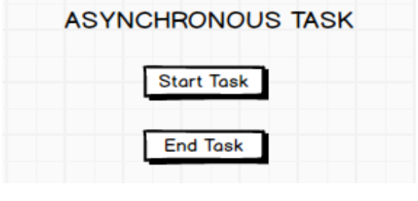

### 7

Develop an application that makes use of the clipboard framework for copying and pasting of the text. The activity consists of two EditText controls and two Buttons to trigger the copy and paste functionality.

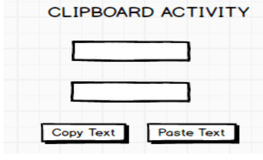

### 8

Create an AIDL service that calculates Car Loan EMI. The formula to calculate EMI is

```
E = P * (r (1 + r)^n ) / ((1 + r)^n - 1)
```
where
- E = The EMI payable on the car loan amount
- P = The Car loan Principal Amount
- r = The interest rate value computed on a monthly basis
- n = The loan tenure in the form of months

The down payment amount has to be deducted from the principal amount paid towards buying the Car. Develop an application that makes use of this AIDL service to calculate the EMI. This application should have four EditText to read the PrincipalAmount, Down Payment, Interest Rate, Loan Term (in months) and a button named as “Calculate Monthly EMI”. On click of this button, the result should be shown in a TextView. Also, calculate the EMI by varying the Loan Term and Interest Rate values.

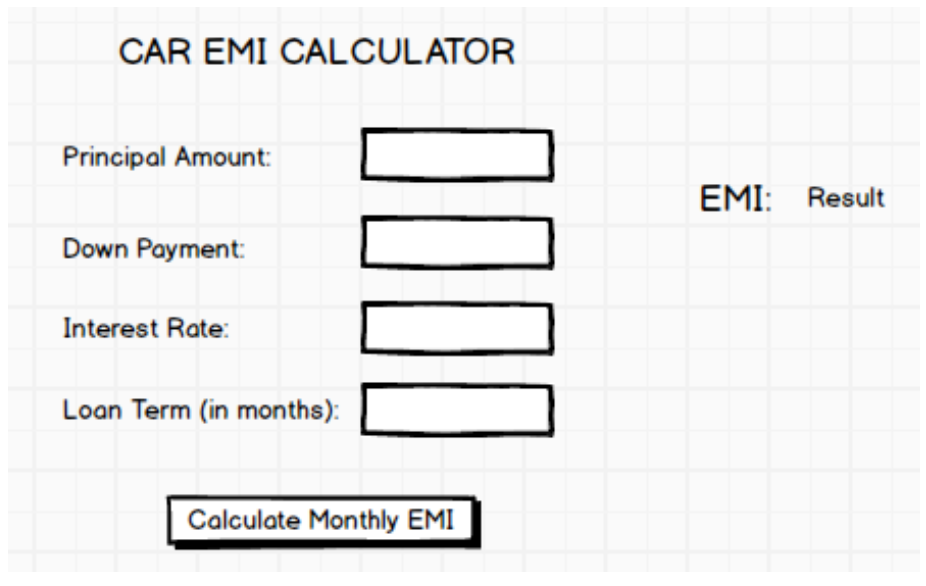